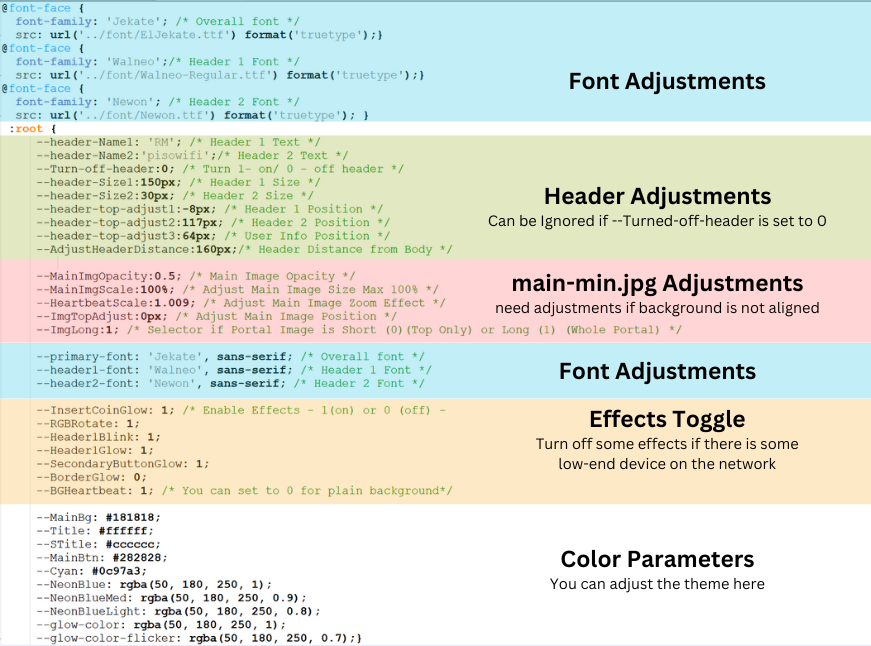

# Lazy Portal v7 - RMTheme 2

<iframe width="800" height="450" src="https://www.youtube.com/embed/G_BOb4uyBSs?autoplay=1&mute=1&vq=hd1080" frameborder="0" allow="accelerometer; autoplay; encrypted-media; gyroscope; picture-in-picture" allowfullscreen></iframe>

## Downloads
<a href="https://raw.githubusercontent.com/RMBDon/Lazy-Portal-v7-RMTheme-2/main/Downloads/style.zip" download>Latest CSS</a> || 
<a href="https://raw.githubusercontent.com/RMBDon/Lazy-Portal-v7-RMTheme-2/main/Downloads/[OLD] - Last Version.zip" download>Old CSS</a> || 
<a href="https://raw.githubusercontent.com/RMBDon/Lazy-Portal-v7-RMTheme-2/main/Downloads/Fonts/ElJekate.ttf" download>Font 1</a> || 
<a href="https://raw.githubusercontent.com/RMBDon/Lazy-Portal-v7-RMTheme-2/main/Downloads/Fonts/Newon.ttf" download>Font 2</a> || 
<a href="https://raw.githubusercontent.com/RMBDon/Lazy-Portal-v7-RMTheme-2/main/Downloads/Fonts/Walneo-Regular.ttf" download>Font 3</a> || 
<a href="https://raw.githubusercontent.com/RMBDon/Lazy-Portal-v7-RMTheme-2/main/Downloads/main-min/main-min.jpg" download>main-min (top)</a> || 
<a href="https://raw.githubusercontent.com/RMBDon/Lazy-Portal-v7-RMTheme-2/main/Downloads/main-min/main-min-1 (2).jpg" download>main-min (whole)</a> || 

 ### main-min Image Canva Templates:

   - [Main-min canva Template 1 - Only Top](https://www.canva.com/design/DAGIJDVpBbw/-p_QgYGILMwf7lAiWbmQww/view?utm_content=DAGIJDVpBbw&utm_campaign=designshare&utm_medium=link&utm_source=publishsharelink&mode=preview)
        
   - [Main-min canva Template 3 - Whole](https://www.canva.com/design/DAGJcFIqoeo/R7V45gM_zOol4vwTgUuuUQ/view?utm_content=DAGJcFIqoeo&utm_campaign=designshare&utm_medium=link&utm_source=publishsharelink&mode=preview)

## Instructions

### 1. Replace `style.css` at `/hotspot/assets/css/`

### 2. Pick any images on the main-min folder or the templates to use. Rename the file to `main-min.jpg` and replace `main-min.jpg` at `/hotspot/assets/img/`
   - **Note:**
   - The Images used have the dimensions ``(380px × 337px)`` for top portion only and ``(400px × 950px)``. They have different dimensions compared to the default jpg ``(600px × 345px)``.

   - There are 4 types of images that can be used for the portal (Only Top No Text, Only Top Have Text, Whole No Text and Whole have Text)
     - Only Top No Text
       - Images are only at the top portion `380px × 337pxx` without any text, css settings should be **`--Turn-off-header: 1`** and adjust Text accordingly (use comments as guide)
     - Only Top With Text
       - Images are only at the top portion `380px × 337pxx` and have text already, recommended css settings should be **`--Turn-off-header: 0`**
     - Whole No Text
       - Images are only at the top portion `400px x 950px` without any text, css settings should be **`--Turn-off-header: 1`** and adjust Text accordingly (use comments as guide)
     - Whole have Text
       - Images covered the whole portal `400px x 950px` and have text already, recommended css settings should be **`--Turn-off-header: 0`**

### 3. Fonts can be edited for Main Font, Header 1, Header 2
   - Place the Referenced Fonts at `/hotspot/assets/font/`
   - Edit the Name of the font also it's respective directory at the css file
     - **Note:** 
     	Adjust according to your text, especially the Header Font Size and the Spacing

### 4. Adjust the headers, images and effects accordingly. Comments are provided for easy guidance. [Click here](https://1drv.ms/v/s!AudVBigMgximj9IrItSNTz_V5x7s2w) if you want to know how to view/get parameters easier using PC Browser Inspect. 

### 5. You can enable/disable effects on the css file. Test which one to disable depending on the devices on your network (Have low-end devices).

   - **Recommendations:**
     
      1. Use main-min image only for branding.
     
       a. Disable header by setting the `--Turn-off-header` to 0, use the `Canva Template 2 - Whole` provided above and adjust the parameters needed to center the image.
     
       b. The parameters involve in centering the image are:
     
        - `--MainImgScale : 100%` (Ensure that the image is equal or less than the whole screen to avoid glitching) (max of 100%)
     
        - `--AdjustHeaderDistance` (This adjusts the positions of the buttons below. Make sure you give enough space for hidden buttons)
     
        - `--ImgTopAdjust` (This adjusts the main-min on the portal. Make sure to adjust this when using other images given on this page)

<iframe width="800" height="450" src="https://www.youtube.com/embed/7wwzAC6C3Vs?autoplay=1&mute=1&vq=hd1080" frameborder="0" allow="accelerometer; autoplay; encrypted-media; gyroscope; picture-in-picture" allowfullscreen></iframe>

---

# If nagustuhan nyo boss, pangkape lang 🤣☕️ 09760049167  
## Maraming Salamat!

### zip password - lazy5491
